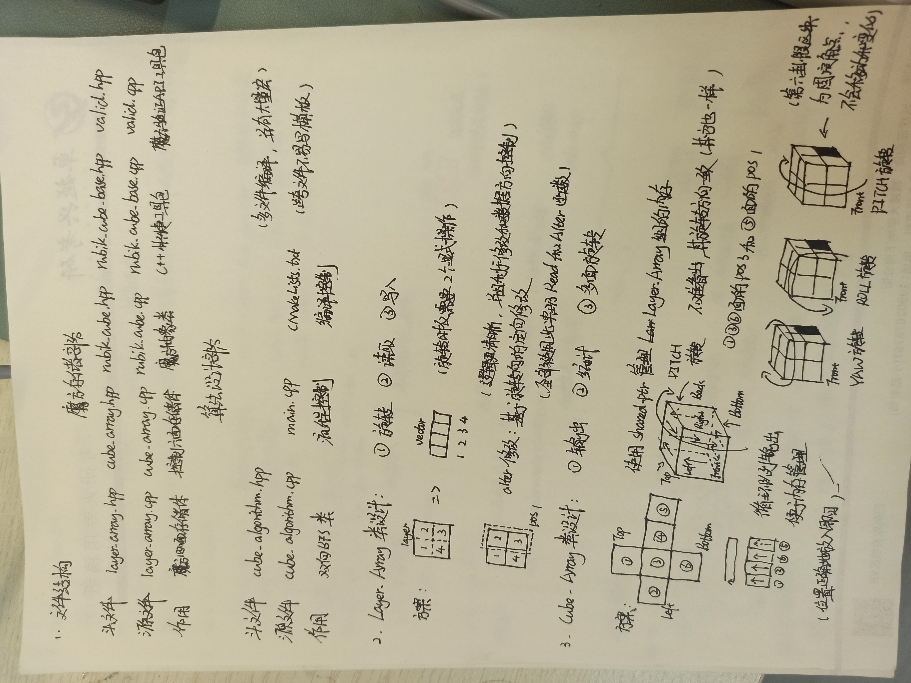
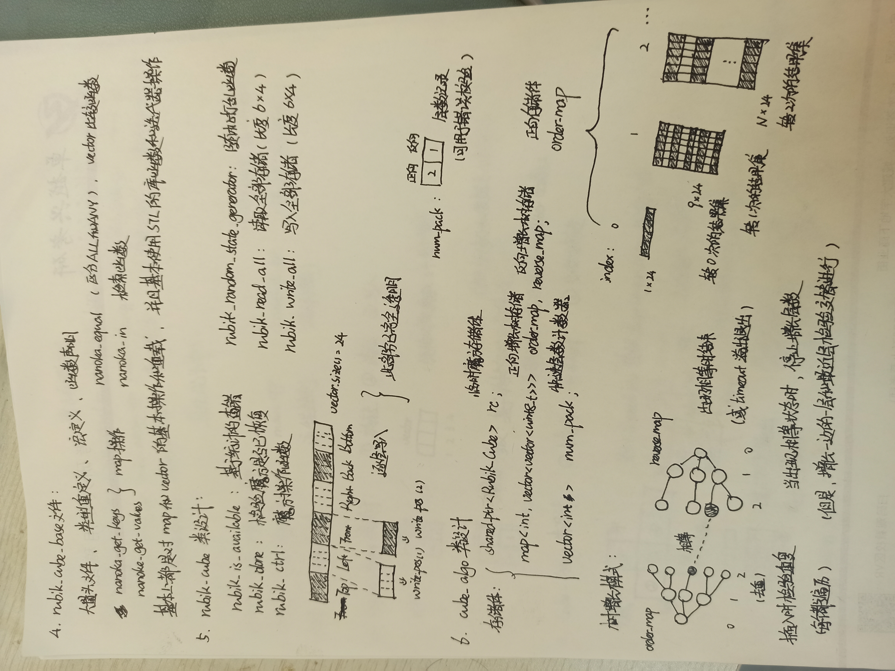

# 三阶魔方上帝之数
#### 二阶最终结果
##### 1.231s - main
##### 0.126s - NoAssert

#### 存储结构


#### 算法设计


# 使用教程
#### 介绍
算法设计：二阶魔方程序

#### Cmake + MinGW-Make使用说明

Cmake 命令示例

```
cd build
cmake -G "MinGW Makefiles" ..
make
./bin/main.exe
```

Git 命令示例

```
git init
git add remote origin <url>
git pull --rebase origin master
# 这边修改好文件之后
git add *
git commit -am"xxx" # xxx 是你要添加的注释
git branch -M yyy   # yyy 是你要新添加的分支
git push -u nanoka yyy
```
